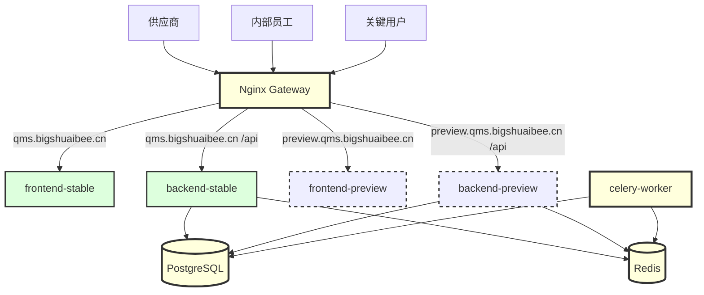

# Project Structure

## Organization

本项目采用 **Monorepo（单体仓库）** 结构，通过 Docker Compose 统一编排。当前仓库已经形成“底座优先”的工程基线：

- **backend/**：FastAPI + SQLAlchemy + Alembic，承载认证、权限、工作台、业务模块 API 与后台管理能力。
- **frontend/**：Vue 3 + Vite + Element Plus + Pinia，承载统一登录、工作台、权限矩阵、管理员后台与业务页面。
- **deployment/**：Nginx、Docker、环境部署配置。
- **doc/**：交接、规范、需求面板、联调和上云相关文档。
- **.kiro/**：产品、结构、规格设计等源文档。

## Root Directory

```text
/
├── .kiro/                  # 产品、结构、规格与 steering 规则
├── .agents/                # 执行计划模板、技能等协作资产
├── .codex/                 # 仓库级 Codex 配置
├── backend/                # 后端代码
├── frontend/               # 前端代码
├── deployment/             # Nginx / Docker / 部署配置
├── doc/                    # 交接文档、专题说明、需求面板资料
├── uploads/                # 本地运行上传文件目录
├── AGENTS.md               # 项目级协作契约
├── docker-compose.yml      # 双环境容器编排
├── .env.example            # 环境变量模板
├── .env.production         # 生产环境变量模板
└── README.md
```

## Backend Structure (`/backend`)

```text
backend/
├── app/
│   ├── api/
│   │   └── v1/
│   │       ├── auth.py                 # 注册、登录、会话查询、验证码
│   │       ├── profile.py              # 个人中心、头像、密码、签名
│   │       ├── workbench.py            # 工作台聚合接口
│   │       ├── feature_flags.py        # 用户侧功能开关查询
│   │       └── admin/                  # 管理员接口（users / permissions / feature_flags 等）
│   ├── core/                           # 配置、安全、平台管理员、权限依赖
│   ├── models/                         # SQLAlchemy ORM 模型
│   ├── schemas/                        # Pydantic Schema
│   ├── services/                       # 业务服务、任务聚合、功能开关、会话序列化
│   └── main.py                         # FastAPI 入口
├── alembic/
│   └── versions/                       # 数据库迁移版本
├── scripts/                            # smoke、初始化与迁移校验脚本
├── test/                               # pytest 用例
├── doc/                                # 后端专题文档
├── uploads/                            # 容器/本地上传目录
├── requirements.txt
├── alembic.ini
└── Dockerfile
```

### Backend Current Notes

- 当前测试目录实际为 `backend/test/`，不是 `backend/tests/`。
- 第一里程碑核心 smoke 已固化在 `backend/scripts/run_foundation_smoke.py`。
- 管理端接口统一集中在 `backend/app/api/v1/admin/` 下，当前已落地用户管理、权限矩阵、功能开关等底座能力。

## Frontend Structure (`/frontend`)

```text
frontend/
├── src/
│   ├── api/                            # Axios API 封装
│   ├── assets/                         # 静态资源
│   ├── components/                     # 通用组件
│   ├── composables/                    # 组合式逻辑
│   ├── config/                         # 工作台快捷入口等前端配置
│   ├── features/                       # 需求面板等功能域实现
│   ├── layouts/                        # 主布局、导航容器
│   ├── router/                         # 路由守卫与环境/权限控制
│   ├── stores/                         # Pinia store（auth / featureFlag 等）
│   ├── types/                          # 类型定义
│   ├── views/                          # 页面视图（Workbench、Admin 页面、业务模块）
│   └── main.ts                         # 前端入口
├── package.json
├── vite.config.ts
├── vitest.config.ts
└── Dockerfile
```

### Frontend Current Notes

- 当前工作台、系统设置、权限矩阵、功能开关、需求面板都已在 `frontend/src/views/` 或 `frontend/src/features/` 落地。
- 第一里程碑最小前端回归由 `npm run test:foundation` 固化。
- 前端默认遵循 [`doc/FRONTEND_UI_COPY_REQUIREMENTS.md`](/E:/WorkSpace/QMS/doc/FRONTEND_UI_COPY_REQUIREMENTS.md) 的界面文案约束。

## Collaboration Assets

```text
AGENTS.md                 # 项目级协作契约
.agents/PLANS.md          # 大型任务 ExecPlan 模板
.codex/config.toml        # 仓库级 Codex 默认配置
doc/PROJECT_DEVELOPMENT_HANDOFF.md
```

这些文件共同构成当前仓库的协作与执行基线：

- `AGENTS.md`：定义技术栈、命令、边界、渐进式阅读入口。
- `.agents/PLANS.md`：要求大任务先计划、再执行、持续记录验证与决策。
- `doc/PROJECT_DEVELOPMENT_HANDOFF.md`：为新线程提供最小但足够的上下文材料。

## Naming Conventions

- **Python / Backend**
  - 文件与函数使用 `snake_case`
  - 类名使用 `PascalCase`
- **Vue / Frontend**
  - 组件与页面使用 `PascalCase`
  - 工具模块、配置与组合式函数使用 `camelCase`
- **API Endpoints**
  - URL 使用 `kebab-case`
  - 管理端按 `/api/v1/admin/...` 归档

## Runtime Topology

当前部署拓扑已经明确为 **Stable / Preview 双环境 + 共享数据库底座**：



### Current Deployment Notes

- `stable` 与 `preview` 通过不同域名区分，而不是通过 `/api/preview` 路径切换。
- 两套环境共享同一个 PostgreSQL 数据库，数据库迁移必须遵守非破坏性原则。
- Redis 通过不同逻辑库区分部分环境和任务用途。
- 功能开关按“环境优先，再按 global / whitelist 判断”执行可见性控制。

## Development and Verification Flow

当前仓库默认使用以下校验路径：

- 前端构建：`Set-Location frontend; npm run build`
- 前端底座回归：`Set-Location frontend; npm run test:foundation`
- 后端测试：`& '.\\.venv\\Scripts\\python.exe' -m pytest backend/test`
- 后端底座 smoke：`& '.\\.venv\\Scripts\\python.exe' backend/scripts/run_foundation_smoke.py`
- 迁移演练：`Set-Location backend; & '..\\.venv\\Scripts\\python.exe' -m alembic upgrade head`
- 编排校验：`docker compose config`

## Documentation Sync Rule

如果后续需求、规划或设计升级，且与 `.kiro/steering/product.md`、本文件、`.kiro/specs/qms-foundation-and-auth/requirements.md`、`.kiro/specs/qms-foundation-and-auth/design.md` 不一致，必须同步更新这些源文档，不能只改代码。
