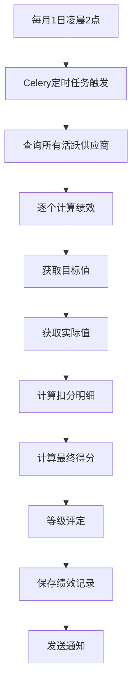
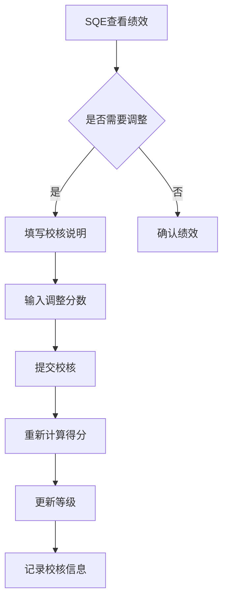
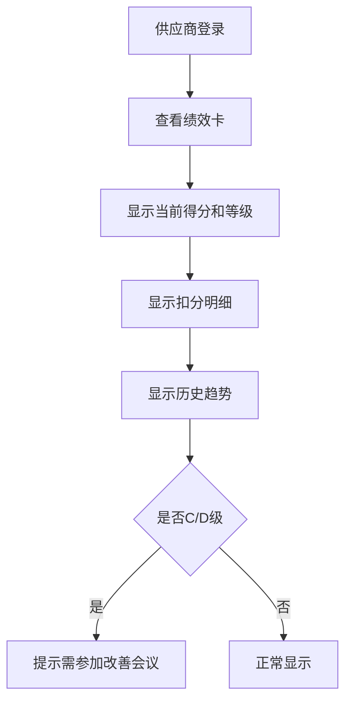

# 供应商绩效评价实现文档

## 概述

本文档描述供应商绩效评价模块（Task 10.6）的实现细节。该模块实现了基于60分制扣分模型的供应商月度绩效评价系统，支持自动计算、人工评价和校核功能。

## 核心功能

### 1. 绩效计算引擎（PerformanceCalculator）

采用60分制扣分模型，按100分满分折算百分制：

#### 1.1 来料质量扣分
- **数据源**：2.4.1 质量指标中的"来料批次合格率"
- **目标值**：从 2.5.4 供应商质量目标获取
- **扣分规则**：
  - 达标：扣0分
  - 差距 < 10%：扣5分
  - 10% ≤ 差距 < 20%：扣15分
  - 差距 ≥ 20%：扣30分

#### 1.2 制程质量扣分
- **数据源**：2.4.1 质量指标中的"物料上线不良PPM"
- **目标值**：从 2.5.4 供应商质量目标获取
- **扣分规则**：
  - 达标：扣0分
  - 0 < 超标 ≤ 50%：扣5分
  - 50% < 超标 ≤ 100%：扣15分
  - 超标 > 100%：扣30分

#### 1.3 配合度扣分
- **数据源**：SQE 人工评价
- **扣分规则**：
  - 高（high）：扣0分
  - 中（medium）：扣5分
  - 低（low）：扣10分

#### 1.4 0公里/售后质量扣分
- **数据源**：2.7 客诉记录（待实现）
- **扣分规则**：
  - 个例物料问题：每次扣10分
  - 批量重大质量异常：每次扣20分
  - 安全问题：每次扣30分

#### 1.5 最终得分计算
```python
score_60 = max(0, 60 - 总扣分)
final_score = (score_60 / 60) * 100
```

#### 1.6 等级评定
- **A级**：得分 > 95
- **B级**：80 ≤ 得分 ≤ 95
- **C级**：70 ≤ 得分 < 80
- **D级**：得分 < 70

### 2. 绩效管理服务（SupplierPerformanceService）

#### 2.1 自动计算绩效
```python
calculate_and_save_performance(
    db: AsyncSession,
    supplier_id: int,
    year: int,
    month: int,
    cooperation_level: Optional[CooperationLevel] = None,
    cooperation_comment: Optional[str] = None
) -> SupplierPerformance
```

#### 2.2 配合度评价
```python
evaluate_cooperation(
    db: AsyncSession,
    performance_id: int,
    evaluation: CooperationEvaluation,
    evaluated_by: int
) -> SupplierPerformance
```

#### 2.3 人工校核
```python
review_performance(
    db: AsyncSession,
    performance_id: int,
    review: PerformanceReview,
    reviewed_by: int
) -> SupplierPerformance
```

支持人工调整分数（正数为加分，负数为扣分），用于特殊情况的核减或加分。

#### 2.4 绩效卡查询
```python
get_performance_card(
    db: AsyncSession,
    supplier_id: int,
    year: int,
    month: int
) -> Dict[str, Any]
```

返回供应商视图的绩效卡，包含：
- 当前绩效得分和等级
- 本月扣分明细
- 历史趋势（最近6个月）
- 是否需要参加改善会议（C/D级）

#### 2.5 绩效统计
```python
get_performance_statistics(
    db: AsyncSession,
    year: int,
    month: int
) -> Dict[str, Any]
```

返回月度绩效统计，包含：
- 总供应商数
- 等级分布（A/B/C/D）
- 平均得分
- Top5/Bottom5供应商
- 需要关注的供应商（C/D级）

### 3. API 接口

#### 3.1 查询接口
- `GET /api/v1/supplier-performance` - 获取绩效列表（支持筛选和分页）
- `GET /api/v1/supplier-performance/{performance_id}` - 获取绩效详情
- `GET /api/v1/supplier-performance/card/{supplier_id}` - 获取绩效卡
- `GET /api/v1/supplier-performance/statistics/{year}/{month}` - 获取绩效统计

#### 3.2 操作接口
- `POST /api/v1/supplier-performance/calculate/{supplier_id}` - 手动触发绩效计算
- `POST /api/v1/supplier-performance/batch-calculate/{year}/{month}` - 批量计算月度绩效
- `POST /api/v1/supplier-performance/{performance_id}/evaluate-cooperation` - 评价配合度
- `POST /api/v1/supplier-performance/{performance_id}/review` - 人工校核

### 4. Celery 定时任务

#### 4.1 每月自动计算
```python
@shared_task(name="calculate_monthly_supplier_performances")
def calculate_monthly_supplier_performances():
    """每月1日凌晨2点自动计算所有供应商的绩效"""
```

**Celery Beat 配置**：
```python
CELERY_BEAT_SCHEDULE = {
    'calculate-monthly-performances': {
        'task': 'calculate_monthly_supplier_performances',
        'schedule': crontab(day_of_month='1', hour='2', minute='0'),
    },
}
```

#### 4.2 手动重算
```python
@shared_task(name="recalculate_supplier_performance")
def recalculate_supplier_performance(supplier_id: int, year: int, month: int):
    """重新计算指定供应商的绩效"""
```

## 数据模型

### SupplierPerformance 表结构

```sql
CREATE TABLE supplier_performances (
    id SERIAL PRIMARY KEY,
    supplier_id INTEGER NOT NULL REFERENCES suppliers(id),
    year INTEGER NOT NULL,
    month INTEGER NOT NULL,
    
    -- 扣分明细（60分制）
    incoming_quality_deduction FLOAT DEFAULT 0.0,
    process_quality_deduction FLOAT DEFAULT 0.0,
    cooperation_deduction FLOAT DEFAULT 0.0,
    zero_km_deduction FLOAT DEFAULT 0.0,
    total_deduction FLOAT DEFAULT 0.0,
    
    -- 最终得分和等级
    final_score FLOAT NOT NULL,
    grade VARCHAR(10) NOT NULL,
    
    -- 配合度评价
    cooperation_level VARCHAR(20),
    cooperation_comment TEXT,
    
    -- SQE人工校核
    is_reviewed BOOLEAN DEFAULT FALSE,
    reviewed_by INTEGER REFERENCES users(id),
    reviewed_at TIMESTAMP,
    review_comment TEXT,
    manual_adjustment FLOAT DEFAULT 0.0,
    
    -- 审计字段
    created_at TIMESTAMP DEFAULT CURRENT_TIMESTAMP,
    updated_at TIMESTAMP DEFAULT CURRENT_TIMESTAMP,
    
    -- 唯一约束
    UNIQUE(supplier_id, year, month)
);
```

### 索引
- `ix_supplier_performances_supplier_id`
- `ix_supplier_performances_year`
- `ix_supplier_performances_month`
- `ix_supplier_performances_grade`
- `ix_supplier_performances_year_month`

## 业务流程

### 1. 月度绩效计算流程



### 2. SQE 人工校核流程



### 3. 供应商视图流程



## 测试用例

### 1. 单元测试
- `test_calculate_final_score` - 测试最终得分计算
- `test_determine_grade` - 测试等级评定
- `test_calculate_cooperation_deduction` - 测试配合度扣分
- `test_calculate_incoming_quality_deduction` - 测试来料质量扣分

### 2. API 测试
- `test_calculate_performance` - 测试手动触发绩效计算
- `test_get_performances` - 测试获取绩效列表
- `test_get_performance_card` - 测试获取绩效卡
- `test_evaluate_cooperation` - 测试配合度评价
- `test_review_performance` - 测试人工校核
- `test_get_performance_statistics` - 测试绩效统计

## 依赖关系

### 上游依赖
- **2.5.4 供应商质量目标**：提供目标值
- **2.4.1 质量数据面板**：提供实际值（来料合格率、物料上线PPM）
- **2.7 客户质量管理**：提供客诉数据（待实现）

### 下游影响
- **2.5.6 供应商会议管理**：C/D级供应商需参加改善会议
- **供应商门户**：供应商查看绩效卡
- **管理驾驶舱**：绩效统计和分析

## 注意事项

### 1. 数据库兼容性
- 所有新增字段设置为 `nullable=True` 或带有 `server_default`
- 遵循非破坏性迁移原则
- 确保双轨环境（Preview/Stable）兼容

### 2. 性能优化
- 使用索引优化查询性能
- 批量计算时使用异步处理
- 缓存历史趋势数据

### 3. 扩展性
- 扣分规则可配置化（预留系统配置接口）
- 支持自定义扣分项
- 支持多维度分析（按产品类型、物料类别等）

### 4. 待完善功能
- 0公里/售后质量扣分（需等待2.7模块实现）
- 邮件通知（绩效生成、C/D级预警）
- 绩效趋势预测（AI分析）

## 使用示例

### 1. 手动计算绩效
```bash
curl -X POST "http://localhost:8000/api/v1/supplier-performance/calculate/1" \
  -H "Authorization: Bearer {token}" \
  -d "year=2024&month=1&cooperation_level=high"
```

### 2. 查询绩效列表
```bash
curl -X GET "http://localhost:8000/api/v1/supplier-performance?supplier_id=1&year=2024" \
  -H "Authorization: Bearer {token}"
```

### 3. 获取绩效卡
```bash
curl -X GET "http://localhost:8000/api/v1/supplier-performance/card/1?year=2024&month=1" \
  -H "Authorization: Bearer {token}"
```

### 4. 人工校核
```bash
curl -X POST "http://localhost:8000/api/v1/supplier-performance/1/review" \
  -H "Authorization: Bearer {token}" \
  -H "Content-Type: application/json" \
  -d '{
    "review_comment": "考虑到供应商积极配合整改，核减5分",
    "manual_adjustment": 5.0
  }'
```

## 总结

供应商绩效评价模块已完整实现，包括：
- ✅ 60分制扣分模型计算引擎
- ✅ 来料质量扣分计算
- ✅ 制程质量扣分计算
- ✅ 配合度扣分计算
- ✅ 等级评定（A/B/C/D）
- ✅ SQE人工校核功能
- ✅ Celery定时任务（每月1日自动计算）
- ✅ 完整的API接口
- ✅ 数据库迁移脚本
- ✅ 单元测试和API测试

待完善功能：
- ⏸️ 0公里/售后质量扣分（需等待2.7模块）
- ⏸️ 邮件通知功能
- ⏸️ 绩效趋势预测
