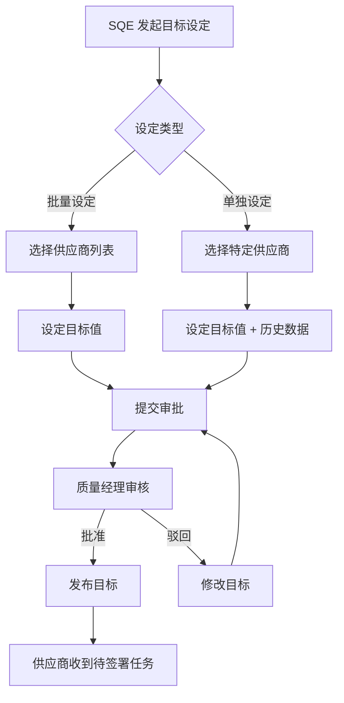
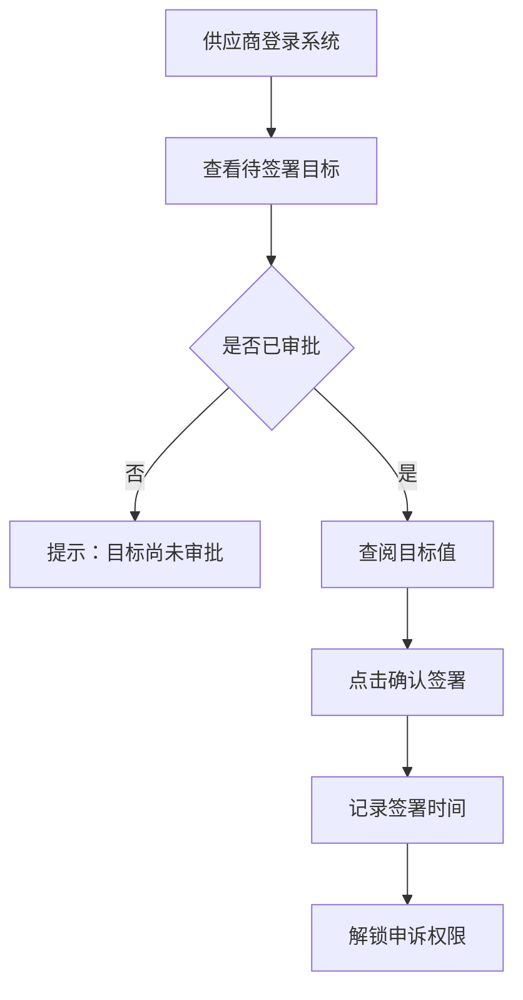
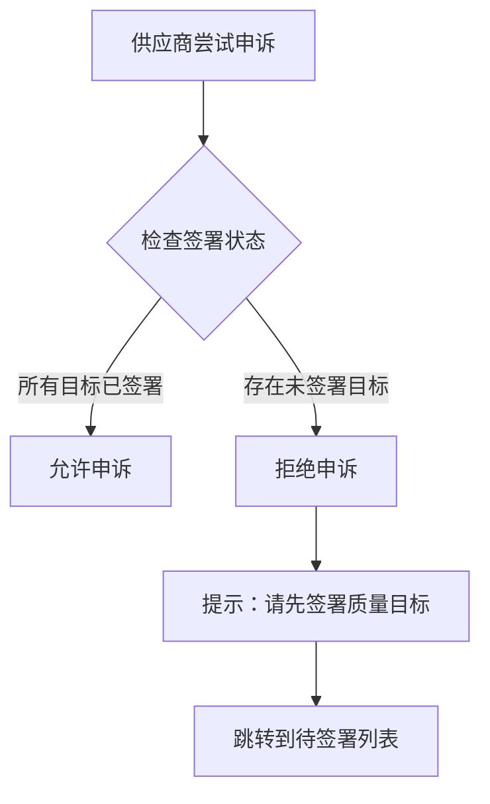

# 供应商质量目标管理实现文档

## 概述

本文档描述供应商质量目标管理模块（Task 10.5）的实现细节，包括批量设定、单独设定、审批流程、供应商签署以及签署互锁机制。

## 功能特性

### 1. 批量设定目标
- **接口**: `POST /api/v1/supplier-targets/batch`
- **权限**: SQE 或质量经理（内部员工）
- **功能**:
  - 按物料类别或供应商等级批量设置通用目标
  - 批量设定不覆盖已存在的单独设定
  - 返回成功/失败统计

### 2. 单独设定目标
- **接口**: `POST /api/v1/supplier-targets/individual`
- **权限**: SQE 或质量经理（内部员工）
- **功能**:
  - 针对特定供应商进行差异化目标配置
  - 单独设定优先级高于批量设定
  - 支持填写历史实际值作为辅助决策数据

### 3. 目标优先级逻辑
**优先级**: 单独设定 > 批量设定 > 全局默认值

实现逻辑：
```python
# 查询时按 is_individual 降序排序
stmt = select(SupplierTarget).where(
    and_(
        SupplierTarget.supplier_id == supplier_id,
        SupplierTarget.year == year,
        SupplierTarget.target_type == target_type
    )
).order_by(desc(SupplierTarget.is_individual))  # 单独设定优先
```

### 4. 辅助决策数据展示
- **接口**: `GET /api/v1/supplier-targets/{supplier_id}/historical-performance`
- **权限**: 内部员工
- **功能**:
  - 在设定界面，系统自动左右分栏展示
  - 左侧：拟设定的目标值
  - 右侧：该供应商历史实际达成值（平均值及波动范围）
  - 辅助 SQE 评估目标的合理性与挑战性

### 5. 审批流程
- **接口**: `POST /api/v1/supplier-targets/approve`
- **权限**: 质量经理
- **流程**: SQE 提交 -> 质量经理审核
- **功能**:
  - 批量审批多个目标
  - 若目标值低于历史实际值，系统自动高亮提示"目标倒退风险"
  - 记录审批时间和审批人

### 6. 供应商签署目标
- **接口**: `POST /api/v1/supplier-targets/{id}/sign`
- **权限**: 供应商用户
- **功能**:
  - 供应商查阅目标值，点击"确认/签署"
  - 必须先审批后签署
  - 记录签署时间和签署人

### 7. 签署互锁机制
- **接口**: `GET /api/v1/supplier-targets/check-permission/{supplier_id}/{year}`
- **功能**:
  - 未签署限制申诉权限
  - 若在规定时间（如 1 月 31 日）前未签署，系统限制其查看绩效申诉权限

## 数据模型

### SupplierTarget 表结构

```python
class SupplierTarget(Base):
    __tablename__ = "supplier_targets"
    
    id: int                          # 主键
    supplier_id: int                 # 供应商ID
    year: int                        # 目标年份
    target_type: TargetType          # 目标类型
    target_value: float              # 目标值
    is_individual: bool              # 是否单独设定
    is_signed: bool                  # 是否已签署
    signed_at: datetime              # 签署时间
    signed_by: int                   # 签署人ID
    is_approved: bool                # 是否已审批
    approved_by: int                 # 审批人ID
    approved_at: datetime            # 审批时间
    previous_year_actual: float      # 上一年实际达成值
    created_at: datetime             # 创建时间
    updated_at: datetime             # 更新时间
    created_by: int                  # 创建人ID
```

### 目标类型枚举

```python
class TargetType(str, enum.Enum):
    INCOMING_PASS_RATE = "incoming_pass_rate"      # 来料批次合格率
    MATERIAL_PPM = "material_ppm"                  # 物料上线不良PPM
    PROCESS_DEFECT_RATE = "process_defect_rate"    # 制程不合格率
    ZERO_KM_PPM = "zero_km_ppm"                    # 0KM不良PPM
    MIS_3_PPM = "mis_3_ppm"                        # 3MIS售后不良PPM
    MIS_12_PPM = "mis_12_ppm"                      # 12MIS售后不良PPM
```

## API 接口列表

### 目标设定接口

| 方法 | 路径 | 描述 | 权限 |
|------|------|------|------|
| POST | `/api/v1/supplier-targets/batch` | 批量设定目标 | 内部员工 |
| POST | `/api/v1/supplier-targets/individual` | 单独设定目标 | 内部员工 |
| PUT | `/api/v1/supplier-targets/individual/{id}` | 更新单独目标 | 内部员工 |

### 审批与签署接口

| 方法 | 路径 | 描述 | 权限 |
|------|------|------|------|
| POST | `/api/v1/supplier-targets/approve` | 批量审批目标 | 质量经理 |
| POST | `/api/v1/supplier-targets/{id}/sign` | 供应商签署目标 | 供应商用户 |

### 查询接口

| 方法 | 路径 | 描述 | 权限 |
|------|------|------|------|
| GET | `/api/v1/supplier-targets` | 查询目标列表 | 所有用户 |
| GET | `/api/v1/supplier-targets/{id}` | 获取目标详情 | 所有用户 |
| GET | `/api/v1/supplier-targets/{supplier_id}/historical-performance` | 获取历史绩效数据 | 内部员工 |
| GET | `/api/v1/supplier-targets/statistics/unsigned` | 获取未签署目标统计 | 内部员工 |
| GET | `/api/v1/supplier-targets/check-permission/{supplier_id}/{year}` | 检查签署权限 | 所有用户 |

## 业务流程

### 1. 目标设定流程



### 2. 供应商签署流程



### 3. 签署互锁机制



## 权限控制

### 内部员工权限
- 批量设定目标
- 单独设定目标
- 更新目标
- 审批目标
- 查看所有供应商的目标
- 查看历史绩效数据
- 查看未签署统计

### 供应商用户权限
- 查看自己的目标
- 签署自己的目标
- 检查自己的签署权限
- **限制**: 仅能查看和操作关联到自己供应商ID的目标

## 数据验证

### 批量设定验证
```python
class BatchTargetCreate(BaseModel):
    year: int = Field(..., ge=2020, le=2100)
    target_type: TargetType
    target_value: float = Field(..., ge=0)
    supplier_ids: List[int] = Field(..., min_length=1)
    
    @field_validator('supplier_ids')
    @classmethod
    def validate_supplier_ids(cls, v):
        if len(v) != len(set(v)):
            raise ValueError("供应商ID列表包含重复项")
        return v
```

### 签署验证
```python
class TargetSignRequest(BaseModel):
    confirm: bool = Field(..., description="确认签署（必须为True）")
    
    @field_validator('confirm')
    @classmethod
    def validate_confirm(cls, v):
        if not v:
            raise ValueError("必须确认签署才能提交")
        return v
```

## 测试覆盖

### 单元测试
- ✅ 批量创建目标成功
- ✅ 批量设定不覆盖单独设定
- ✅ 单独创建目标成功
- ✅ 单独设定覆盖批量设定
- ✅ 更新目标后重置审批状态
- ✅ 签署目标成功
- ✅ 签署未审批的目标失败
- ✅ 签署其他供应商的目标失败
- ✅ 批量审批目标成功
- ✅ 查询目标列表
- ✅ 供应商用户仅能查看自己的目标
- ✅ 检查签署权限（已签署）
- ✅ 检查签署权限（未签署）

## 使用示例

### 1. 批量设定目标

```bash
curl -X POST "http://localhost:8000/api/v1/supplier-targets/batch" \
  -H "Authorization: Bearer {token}" \
  -H "Content-Type: application/json" \
  -d '{
    "year": 2026,
    "target_type": "incoming_pass_rate",
    "target_value": 99.8,
    "supplier_ids": [1, 2, 3, 4, 5]
  }'
```

### 2. 单独设定目标

```bash
curl -X POST "http://localhost:8000/api/v1/supplier-targets/individual" \
  -H "Authorization: Bearer {token}" \
  -H "Content-Type: application/json" \
  -d '{
    "supplier_id": 1,
    "year": 2026,
    "target_type": "material_ppm",
    "target_value": 500.0,
    "previous_year_actual": 650.0
  }'
```

### 3. 供应商签署目标

```bash
curl -X POST "http://localhost:8000/api/v1/supplier-targets/123/sign" \
  -H "Authorization: Bearer {supplier_token}" \
  -H "Content-Type: application/json" \
  -d '{
    "confirm": true
  }'
```

### 4. 质量经理审批目标

```bash
curl -X POST "http://localhost:8000/api/v1/supplier-targets/approve" \
  -H "Authorization: Bearer {manager_token}" \
  -H "Content-Type: application/json" \
  -d '{
    "target_ids": [1, 2, 3],
    "approve": true,
    "comment": "目标设定合理，批准发布"
  }'
```

### 5. 检查签署权限

```bash
curl -X GET "http://localhost:8000/api/v1/supplier-targets/check-permission/1/2026" \
  -H "Authorization: Bearer {supplier_token}"
```

## 注意事项

### 1. 目标优先级
- 单独设定的目标优先级最高
- 批量设定不会覆盖已存在的单独设定
- 更新目标值时，如果已签署或已审批，需要重置状态

### 2. 审批与签署顺序
- 必须先审批后签署
- 签署前必须确保目标已审批
- 驳回审批时，自动重置签署状态

### 3. 权限隔离
- 供应商用户仅能查看和操作自己的目标
- 内部员工可以查看所有目标
- 质量经理才能审批目标

### 4. 签署互锁
- 未签署目标会限制供应商的申诉权限
- 系统自动检查签署状态
- 建议在绩效评价模块中集成此检查

## 后续扩展

### 1. 历史绩效数据集成
- 从 `quality_metrics` 表查询历史实际值
- 计算平均值、最小值、最大值、标准差
- 生成月度趋势图

### 2. 目标倒退风险提示
- 在审批界面，自动对比目标值与历史实际值
- 若目标值低于历史平均值，高亮提示"目标倒退风险"
- 提供风险评估建议

### 3. 签署截止日期管理
- 从系统配置读取签署截止日期（如 1 月 31 日）
- 自动发送提醒邮件
- 逾期未签署自动触发预警

### 4. 目标达成监控
- 在绩效评价模块中，自动对比实际值与目标值
- 计算达成率
- 生成目标达成趋势图

## 相关文档

- [需求文档](../.kiro/specs/qms-foundation-and-auth/requirements.md) - Requirement 2.5.4
- [设计文档](../.kiro/specs/qms-foundation-and-auth/design.md)
- [任务清单](../.kiro/specs/qms-foundation-and-auth/tasks.md) - Task 10.5
- [产品需求](../.kiro/steering/product.md) - 2.5.4 供应商质量目标发布

## 更新日志

- 2026-02-13: 初始实现，完成所有核心功能
  - 批量设定目标
  - 单独设定目标
  - 目标优先级逻辑
  - 辅助决策数据展示（接口预留）
  - 审批流程
  - 供应商签署
  - 签署互锁机制
